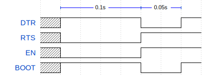

.. _config:

Configuration File
==================

``esptool.py`` relies on serial communication when connecting to, reading from, or writing to an ESP chip.
To ensure this two-way serial connection works properly, ``esptool.py`` is tuned with several pre-defined
variables describing the timings and other nuances when sending or receiving data.
These variables have been finely tuned to work in absolute majority of environments.
However, it is impossible to cover all of the existing combinations of hardware, OS, and drivers.
Sometimes little tweaking is necessary to cover even the most extreme edge cases.

These options can be specified in a configuration file. This makes it easy to run
``esptool.py`` with custom settings, and also allows for specification of options
that are otherwise not available to a user without having to tamper with the source code.

File Location
-------------

The default name for a configuration file is ``esptool.cfg``. First, the same
directory ``esptool.py`` is being run in is inspected.

If a configuration file is not found here, the current user's OS configuration directory is inspected next:

 - Linux: ``/home/<user>/.config/esptool/``
 - macOS ``/Users/<user>/.config/esptool/``
 - Windows: ``c:\Users\<user>\AppData\Local\esptool\``

If a configuration file is still not found, the last inspected location is the home directory:

 - Linux: ``/home/<user>/``
 - macOS ``/Users/<user>/``
 - Windows: ``c:\Users\<user>\``

On Windows, the home directory can be set with the ``HOME`` or ``USERPROFILE`` environment variables.
Therefore, the Windows configuration directory location also depends on these.

A different location for the configuration file can be specified with the ``ESPTOOL_CFGFILE``
environment variable, e.g. ``ESPTOOL_CFGFILE = ~/custom_config.cfg``.
This overrides the search priorities described above.

``esptool.py`` will read settings from other usual configuration files if no other
configuration file is used. It will automatically read from ``setup.cfg`` or
``tox.ini`` if they exist.

As a result, the order of priority of inspected configuration files is:

#. a file specified with the ``ESPTOOL_CFGFILE`` environment variable
#. ``esptool.cfg``
#. ``setup.cfg``
#. ``tox.ini``

Syntax
------

An ``esptool.py`` configuration file is in .ini file format: it must be
introduced by an ``[esptool]`` header to be recognized as valid.
This section then contains ``name = value`` entries.
Lines beginning with ``#`` or ``;`` are ignored as comments.

Delay and timeout options accept float values,
other numeric options are integers. Strings don't need quotes.

Sample configuration file:

.. code-block:: text

    # esptool.cfg file to configure internal settings of esptool
    [esptool]
    chip_erase_timeout = 140
    serial_write_timeout = 8.5
    connect_attempts = 7
    write_block_attempts = 2
    reset_delay = 0.75
    # Overriding the default reset sequence to work in an abnormal environment (prolonged delay):
    custom_reset_sequence = D0|R1|W1.3|D1|R0|W0.5|D0

Options
-------

Complete list of configurable options:

+------------------------------+-----------------------------------------------------------+----------+
| Option                       | Description                                               | Default  |
+==============================+===========================================================+==========+
| timeout                      | Timeout for most flash operations                         | 3 s      |
+------------------------------+-----------------------------------------------------------+----------+
| chip_erase_timeout           | Timeout for a full chip erase                             | 120 s    |
+------------------------------+-----------------------------------------------------------+----------+
| max_timeout                  | The longest any operation can run (e.g. writing a block)  | 240 s    |
+------------------------------+-----------------------------------------------------------+----------+
| sync_timeout                 | Timeout for syncing with the bootloader                   | 0.1 s    |
+------------------------------+-----------------------------------------------------------+----------+
| md5_timeout_per_mb           | Timeout (per megabyte) for calculating md5sum             | 8 s      |
+------------------------------+-----------------------------------------------------------+----------+
| erase_region_timeout_per_mb  | Timeout (per megabyte) for erasing a region               | 30 s     |
+------------------------------+-----------------------------------------------------------+----------+
| erase_write_timeout_per_mb   | Timeout (per megabyte) for erasing and writing data       | 40 s     |
+------------------------------+-----------------------------------------------------------+----------+
| mem_end_rom_timeout          | Short timeout for MEM_END                                 | 0.2 s    |
+------------------------------+-----------------------------------------------------------+----------+
| serial_write_timeout         | Timeout for serial port write                             | 10 s     |
+------------------------------+-----------------------------------------------------------+----------+
| connect_attempts             | Default number of times to try connection                 | 7        |
+------------------------------+-----------------------------------------------------------+----------+
| write_block_attempts         | Number of times to try writing a data block               | 3        |
+------------------------------+-----------------------------------------------------------+----------+
| reset_delay                  | Time to wait before the boot pin is released after reset  | 0.05 s   |
+------------------------------+-----------------------------------------------------------+----------+
| open_port_attempts           | Number of attempts to open the port (0 - infinite)        | 1        |
+------------------------------+-----------------------------------------------------------+----------+
| custom_reset_sequence        | Custom reset sequence for resetting into the bootloader   |          |
+------------------------------+-----------------------------------------------------------+----------+
| custom_hard_reset_sequence   | Custom reset sequence for hard resetting the chip         |          |
+------------------------------+-----------------------------------------------------------+----------+

.. note::

    ``connect_attempts`` is the number of attempts to connect to the chip after the port is detected. This is useful when the chip does not enter bootloader mode immediately. For example, when :ref:`automatic bootloader mode <automatic-bootloader>` does not work and :ref:`manual bootloader mode <manual-bootloader>` has to be used.

    On the other hand, ``open_port_attempts`` is the number of attempts to look for a port to open. When starting the command, the port does not have to be available. This can be useful when the chip is in deep sleep and is connected using USB-Serial/JTAG. In such cases, the port can disappear.

Custom Reset Sequences
----------------------

The ``custom_reset_sequence`` configuration option allows you to define a reset sequence which will get
used when an :ref:`automatic reset into the serial bootloader <automatic-bootloader>` is performed.

The ``custom_hard_reset_sequence`` option allows you to define a reset sequence which will get
used when a hard reset (a reset out of the bootloader) is performed.

A sequence is defined with a string in the following format:

- Consists of individual commands divided by ``|`` (e.g. ``R0|D1|W0.5``).
- Commands (e.g. ``R0``) are defined by a code (``R``) and an argument (``0``).

+------+-----------------------------------------------------------+-----------------+
| Code | Action                                                    | Argument        |
+======+===========================================================+=================+
| D    | Set DTR control line                                      | ``1``/``0``     |
+------+-----------------------------------------------------------+-----------------+
| R    | Set RTS control line                                      | ``1``/``0``     |
+------+-----------------------------------------------------------+-----------------+
| U    | Set DTR and RTS control lines at the same time            | ``0,0``/``0,1`` |
|      | (Unix-like systems only)                                  | ``1,0``/``1,1`` |
+------+-----------------------------------------------------------+-----------------+
| W    | Wait for ``N`` seconds (where ``N`` is a float)           | ``N``           |
+------+-----------------------------------------------------------+-----------------+

For example: ``D0|R1|W0.1|D1|R0|W0.05|D0`` represents the following classic reset sequence:

.. code-block:: python

    _setDTR(False)  # BOOT=HIGH
    _setRTS(True)   # EN=LOW, chip in reset
    time.sleep(0.1)
    _setDTR(True)   # BOOT=LOW
    _setRTS(False)  # EN=HIGH, chip out of reset
    time.sleep(0.05)
    _setDTR(False)  # BOOT=HIGH, done

The sequence can be visualized as follows:

    Signal representation of the reset sequence

.. note::

   Please note that this sequence is representation of signals on Espressif devkit and may differ on other boards.

Similarly, ``R1|W0.1|R0`` represents the classic hard reset sequence:

.. code-block:: python

    _setRTS(True)   # EN=LOW, chip in reset
    time.sleep(0.1)
    _setRTS(False)  # EN=HIGH, chip out of reset
